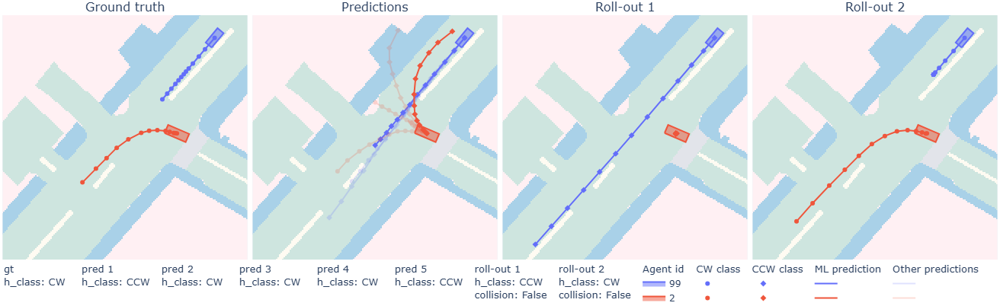

# Evaluating Critical Interacionts in Joint Trajectory Prediction Models
Autonomous Vehicles rely on prediction models to plan collision-free trajectories. To account for multiple route options and the inherent uncertainty in human behavior, models need to be multimodal. However, models can suffer from mode collapse, where only the most likely mode is predicted, posing significant safety risks. While existing methods employ multiple strategies to generate diverse predictions, they often overlook the diversity in interaction modes among agents. Additionally, traditional metrics for evaluating prediction models are dataset-dependent and do not evaluate inter-agent interactions quantitatively. To our knowledge, none of the existing metrics explicitly evaluates mode collapse.
In this paper, we propose a novel evaluation framework that assesses mode collapse in joint trajectory predictions, focusing on safety-critical interactions. We introduce metrics for mode collapse, mode correctness, and coverage, emphasizing the sequential dimension of predictions. By testing four multi-agent trajectory prediction models on the nuScenes dataset, we demonstrate that mode collapse indeed happens. When looking at the sequential dimension, although prediction accuracy improves closer to interaction events, there are still cases where the models are unable to predict the correct interaction mode even just before the interaction mode becomes inevitable.
We hope that our framework can help researchers gain new insights and advance the development of more consistent and accurate prediction models, thus enhancing the safety of autonomous driving systems.

Below we show an examplary visualization of our method, where we evaluate the predicted interaciton modes against the ground truth and other feasible modes.



This repository contains the code to evaluate critical interactions in joint VTP models.
For our algorithm we use [AgentFormers](https://github.com/Khrylx/AgentFormer) preprocessing functions as backbone, see their [README](AF_model/README.md) for more information.
Furthermore, we use [CTTs](https://github.com/NVlabs/diffstack/blob/CTT_release/diffstack/utils/homotopy.py) function to calculate the homotopy class for all agents in a scene. 


## Installation 

### Environment
* **Tested OS:** MacOS, Linux
* Python >= 3.7
* PyTorch == 1.8.0
### Dependencies:
1. Install [PyTorch 1.8.0](https://pytorch.org/get-started/previous-versions/) with the correct CUDA version.
2. Install the dependencies:
    ```
    pip install -r requirements.txt
    ```

### Datasets
* This resposistory already contains the preprocessed scenes of the NuScenes dataset [here](datasets/nuscenes_pred).
* To perform the preprocessing for the nuScenes dataset from scratch, the following steps are required:
  1. Download the orignal [nuScenes](https://www.nuscenes.org/nuscenes) dataset. Checkout the instructions [here](https://github.com/nutonomy/nuscenes-devkit).
  2. Follow the [instructions](https://github.com/nutonomy/nuscenes-devkit#prediction-challenge) of nuScenes prediction challenge. Download and install the [map expansion](https://github.com/nutonomy/nuscenes-devkit#map-expansion).
  3. Run our [script](data/process_nuscenes.py) to obtain a processed version of the nuScenes dataset under [datasets/nuscenes_pred](datasets/nuscenes_pred):
      ```
      python data/process_nuscenes.py --data_root <PATH_TO_NUSCENES>
      ``` 

## Interaction Evaluation
In this repository we provide the following evaluation and visualization scripts:
1. **Finding and analyzing interactive scenarios**. Firstly, we provide a [script](find_interaction_scenes.py) to find interaction scenes from a given dataset. Secondly, we provide a [script](plot_scene_stats.py) to visualize the closeness of those interactions.
2. **Computing and analyzing interaction mode metrics**. Firstly, we provide a [script](eval_modemetrics.py) to compute our novel interaction metrics and visualize the predictions and feasible interaction classes for a given model and dataset. Secondly, we provide a [script](plot_modemetrics_rates.py) to plot the interaction mode metric rates and a [script](plot_modemetrics_time.py) for the time-based interaction metrics. 


